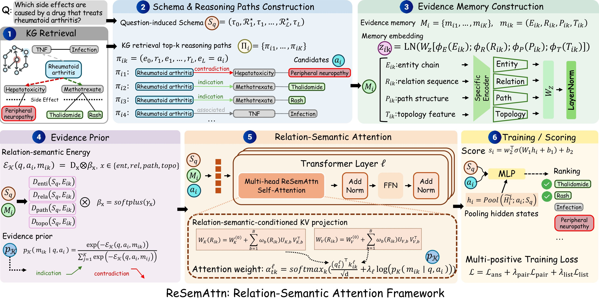

# ReSemAttn: Relation-Semantic Attention for Biomedical Multi-hop Reasoning

## Paper
<center>
  
</center>
Biomedical multi-hop reasoning is the inference of casual relationships across multiple entities and relations within the biomedical knowledge graph (KG), which is essential for discovering hidden connections and analyzing complex mechanisms. Existing methods improve biomedical reasoning by providing more precise search capabilities and more accurate path traversal, but they still face  reachable-but-invalid challenge which means models may select candidates that are topologically reachable yet biologically or semantically invalid for the given question. We propose **ReSemAttn**, a framework that injects relation-semantic-aware evidence prior into model attention, makes KG relation semantics a control signal throughout biomedical multi-hop reasoning. ReSemAttn evaluates whether each candidate-specific path satisfies the question-induced biomedical schema through entity anchoring, relation compatibility, path consistency, and topology reliability. This enables the model to jointly align the question, candidate answer, and KG reasoning path, thereby distinguishing semantically valid biomedical evidence from reachable-but-invalid graph connections. Extensive experiments conducted across diverse biomedical multi-hop benchmarks demonstrate that ReSemAttn significantly enhance both the validity of the reachable path and the accuracy of reasoning.


This repository is a complete, runnable reference implementation of **ReSemAttn**, organized according to the four blocks in the method section of the paper:

1. **Problem setup and schema-guided evidence construction**
2. **Candidate-specific evidence memory and relation-semantic prior**
3. **Relation-semantic attention layer**
4. **Candidate scoring, training, and inference**

The code is designed for BioHopR, PrimeKGQA, and MedReason-style candidate-ranking or QA data. It includes deterministic schema construction, candidate-specific KG path memories, the four mismatch functions \(D_{ent},D_{rel},D_{path},D_{topo}\), relation-conditioned key/value construction, attention-prior injection, gated evidence fusion, multi-answer losses, and evaluation metrics.

## Repository structure

```text
ReSemAttn/
├── configs/
│   └── default.yaml                         # Dataset paths and hyperparameters
├── data/
│   ├── biohopr/                             # Reserved BioHopR folder
│   │   ├── train.jsonl
│   │   ├── dev.jsonl
│   │   └── test.jsonl
│   ├── primekgqa/                           # Reserved PrimeKGQA folder
│   │   ├── train.jsonl
│   │   ├── dev.jsonl
│   │   └── test.jsonl
│   └── medreason/                           # Reserved MedReason folder
│       ├── train.jsonl
│       ├── dev.jsonl
│       └── test.jsonl
├── resemattn/
│   ├── data/
│   │   ├── schema.py                        # Stage 1: deterministic schema parser
│   │   ├── dataset.py                       # JSONL reader and grouped candidate batching
│   │   └── toy_data.py                      # Toy data generator
│   ├── model/
│   │   ├── memory.py                        # Stage 2: path memory and evidence prior
│   │   ├── attention.py                     # Stage 3: relation-semantic attention layer
│   │   ├── losses.py                        # Stage 4: pointwise/pairwise/listwise losses
│   │   └── resemattn.py                     # Full model
│   ├── metrics/
│   │   ├── answer_metrics.py                # Hit@k, P@k, R@k, MRR, EM/F1/Recall
│   │   ├── coverage_metrics.py              # Coverage, CondHit@k, rank-failure
│   │   └── path_validity.py                 # ValidPath@k, InvalidPath@k, AttnValid
│   └── utils/
│       ├── io.py
│       ├── seed.py
│       └── text.py
├── train.py
├── evaluate.py
├── visualize_answer_ranks.py                # Optional rank-distribution heatmap
└── scripts/
    ├── make_toy_data.sh
    ├── run_train_biohopr.sh
    ├── run_eval_biohopr.sh
    └── run_all_toy.sh
```

## Expected data format

Each line is one question with a grouped candidate set:

```json
{
  "qid": "q1",
  "question": "Name all effect/phenotypes which are side effects of drug that can treat disease rheumatoid arthritis.",
  "template": "disease:drug:effect/phenotype",
  "anchor": {"id": "D_RA", "name": "rheumatoid arthritis", "type": "disease"},
  "answer_type": "effect/phenotype",
  "gold_answers": ["Rash"],
  "candidates": [
    {
      "id": "C_RASH",
      "name": "Rash",
      "type": "effect/phenotype",
      "label": 1,
      "paths": [
        {
          "nodes": [
            {"id": "D_RA", "name": "rheumatoid arthritis", "type": "disease"},
            {"id": "DRUG_MT", "name": "Methotrexate", "type": "drug"},
            {"id": "C_RASH", "name": "Rash", "type": "effect/phenotype"}
          ],
          "relations": [
            {"name": "inverse indication", "direction": "reverse"},
            {"name": "side effect", "direction": "forward"}
          ],
          "topology": {"bridge_degree": 34, "endpoint_degree": 5, "branch": 12, "pathcount": 1}
        }
      ]
    }
  ]
}
```

For BioHopR/PrimeKGQA, the schema is constructed deterministically from `template`, `anchor.type`, `answer_type`, and relation-hop metadata when present. No learned schema inducer is required.

## Quick start with toy data

```bash
cd ReSemAttn
python -m resemattn.data.toy_data --out_dir data/biohopr
bash scripts/run_all_toy.sh
```

This will generate a small BioHopR-like toy dataset, train the model for a few steps, evaluate it, and write metrics/predictions under `results/toy_biohopr/`.

## Train on BioHopR

Put files under:

```text
data/biohopr/train.jsonl
data/biohopr/dev.jsonl
data/biohopr/test.jsonl
```

Then run:

```bash
bash scripts/run_train_biohopr.sh
bash scripts/run_eval_biohopr.sh
```

## Train on the other datasets

The paths are already reserved in `configs/default.yaml`:

```yaml
datasets:
  biohopr:
    train: data/biohopr/train.jsonl
    dev: data/biohopr/dev.jsonl
    test: data/biohopr/test.jsonl
  primekgqa:
    train: data/primekgqa/train.jsonl
    dev: data/primekgqa/dev.jsonl
    test: data/primekgqa/test.jsonl
  medreason:
    train: data/medreason/train.jsonl
    dev: data/medreason/dev.jsonl
    test: data/medreason/test.jsonl
```

Use:

```bash
python train.py --config configs/default.yaml --dataset primekgqa --split train
python evaluate.py --config configs/default.yaml --dataset primekgqa --split test --checkpoint checkpoints/primekgqa.pt
```

## Metrics implemented

### Multi-answer candidate-ranking metrics

- Hit@1/5/10
- Precision@1/5/10
- Recall@1/5/10
- MRR

### Single-answer QA metrics

- Exact Match
- token-level F1
- token-level Recall

### Candidate coverage diagnostics

- Candidate coverage rate
- No-positive rate
- Conditional Hit@k
- Ranking failure@k
- Coverage-normalized Hit@k
- Positive density and enrichment@k when full candidate labels are available

### Path-validity diagnostics

- ValidPath@k
- InvalidPath@k
- TopPathValid@k
- Attention-weighted validity (`AttnValid`) when attention weights are saved

## Important implementation note

This repository implements the paper equations in a compact PyTorch model with a trainable Transformer encoder. For production experiments with Qwen3-8B + LoRA, replace the `TextEncoder` in `resemattn/model/resemattn.py` with a HuggingFace causal/decoder backbone and inject `RelationSemanticAttentionLayer` into selected layers. The rest of the code—schema parser, path memory, priors, losses, and metrics—remains the same.

## Reproducing the paper's four-stage method in code

- **Stage 1**: `resemattn/data/schema.py`, `resemattn/data/dataset.py`
- **Stage 2**: `resemattn/model/memory.py`
- **Stage 3**: `resemattn/model/attention.py`
- **Stage 4**: `resemattn/model/resemattn.py`, `resemattn/model/losses.py`, `train.py`, `evaluate.py`
