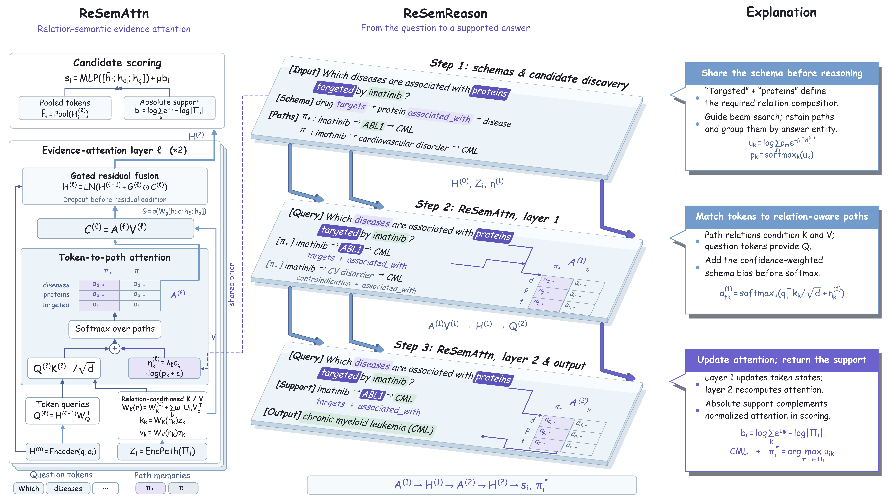

# ReSemReason



ReSemReason is a relation-semantic reasoning framework for biomedical multi-hop question answering over knowledge graphs. It combines soft relation schemas, guided search, and **ReSemAttn** to identify answers and select supporting evidence paths.

## Installation

Requires Python 3.10 or later.

```bash
git clone https://github.com/ZaneLing/ReSemAttn.git
cd ReSemAttn
pip install -e .
```

For the Llama backend, install the optional dependencies with `pip install -e '.[hf]'`.

## Quick start

Run training, inference, and evaluation with the included toy dataset:

```bash
python scripts/train.py --config configs/default.yaml --epochs 1 --output outputs/toy.pt

python scripts/run_inference.py --config configs/default.yaml --checkpoint outputs/toy.pt \
  --question "Which adverse effects are linked to drugs used to treat rheumatoid arthritis?"

python scripts/evaluate.py --config configs/default.yaml --checkpoint outputs/toy.pt --output outputs/toy_eval
```

Benchmark datasets and pretrained task checkpoints are not bundled.

## Documentation

- [Model configurations](configs/)
- [Data formats and experiment protocols](docs/PROTOCOLS.md)
- [Implementation details](docs/IMPLEMENTATION_NOTES.md)

## License

[Apache-2.0](LICENSE).
